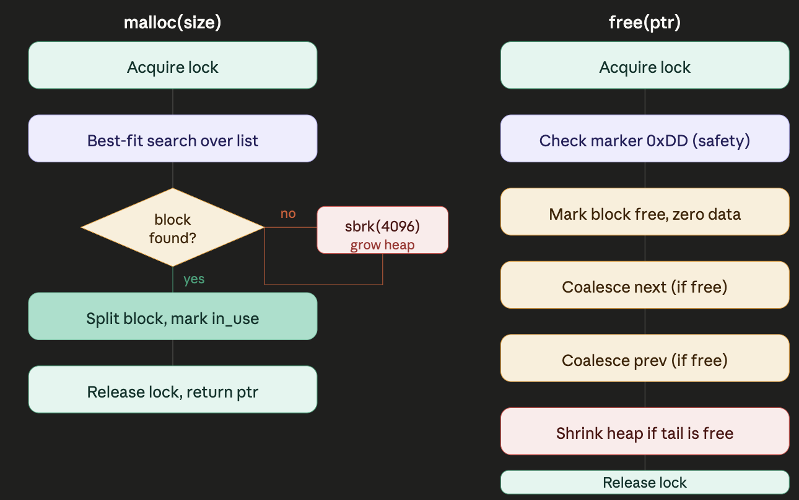

## What I learned

Working through a custom `malloc` / `free` implementation from scratch taught me how memory allocators actually work beneath the abstractions most languages hide.

### Stack vs heap
The stack holds fixed-size values known at compile time and is managed automatically. The heap is a large, resizable region for runtime allocations — but the OS only prevents you from writing *outside* the heap, not from clobbering your own allocations within it. That gap is exactly what an allocator fills.

### sbrk() and the program break
At the OS level, heap memory is controlled by a single pointer called the **program break**. `sbrk(n)` moves it forward by `n` bytes and returns the old address (the start of the new region). `sbrk(0)` reads the current position without moving it. `sbrk(-n)` shrinks the heap and returns pages to the OS. Malloc wraps this syscall and batches it in 4096-byte increments to match the Linux page size — both to avoid wasting partial pages and to minimize expensive user/kernel context switches.

### Data structure: a linked list inside the heap
The allocator stores its bookkeeping *inside* the heap it manages — no separate memory needed. It writes a `stats` header at the very start (magic bytes for initialization detection, a lock, and block counters), followed by a doubly linked list of `block` nodes. Each node has a marker (`0xDD`), `prev`/`next` pointers, a `length` field, and an `in_use` flag. The user gets a pointer past the header — they never see the metadata.

### Best-fit allocation
When `malloc(size)` is called, the allocator walks the entire linked list and picks the **smallest free block that fits** the request. This is the *best-fit* strategy — slower than first-fit (O(n) every time) but it minimizes fragmentation by preserving larger blocks for bigger future requests.

### Block splitting
A chosen block is almost never exactly the right size. Rather than wasting the remainder, the allocator splits it into two: the first becomes the in-use block returned to the caller, the second becomes a new free block inserted into the list. All pointer arithmetic is done through `char *` casts to move exactly one byte at a time.

### Block coalescing
`free(ptr)` doesn't just mark a block unused — it also merges adjacent free neighbors to prevent fragmentation from accumulating over time. It checks both the next and previous blocks: if either is free, the headers and lengths are combined into one larger block. If the tail of the list is free and large enough after coalescing, `sbrk(-PAGE_SIZE)` returns whole pages back to the OS.

### Thread safety
A shared allocator used from multiple threads can corrupt the linked list if two threads race to split the same block. The implementation uses a boolean spinlock in the stats header: each entry point busy-waits until the lock is false, sets it to true, does its work, then releases. A production implementation would replace this with atomic compare-and-swap operations to avoid wasting CPU in the wait loop.

### Safety through markers
The `0xDD` block marker and `0x55` magic header are the allocator's primary safety net. Before any operation, the code asserts these values are in place. This catches double-frees and bad pointers that the standard `free()` would silently corrupt data on. It's not foolproof, but it's far better than traversing raw memory blindly.